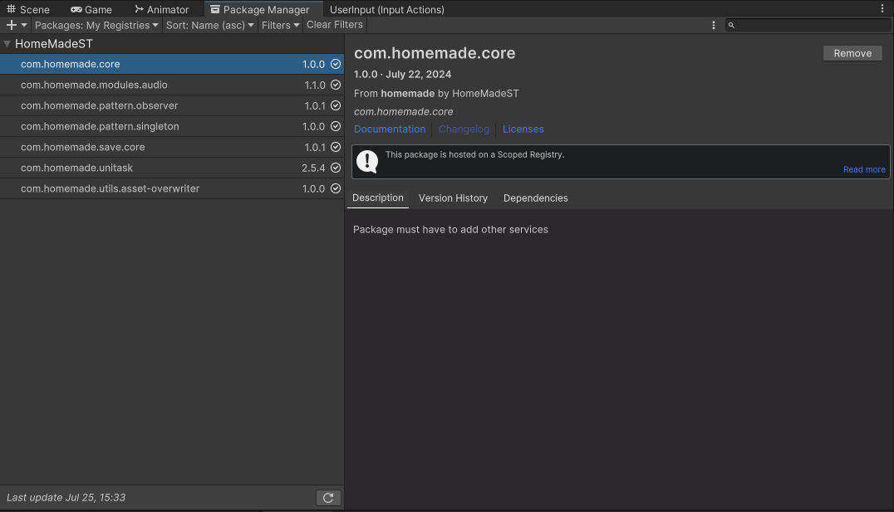

# Introduction

Welcome to my package manager, a comprehensive and powerful suite of tools designed to streamline and enhance your Unity development experience. Whether you're an indie developer, a seasoned professional, or part of a larger studio, our package is crafted to meet your needs and accelerate your workflow.

## Setup scope

### 1. Add scope
- Open Package Manager in Unity.
- Add a new scope follow the image below.

### 2. Import package
- Select Packages tab: My Registries.
- You can add/remove any package that you want

## Import from github
- Github link: [Click here](https://github.com/hungpt17102k?tab=repositories).
- Import in Unity.

 

---
## Finish
**_Check out for more detail in each package_**
