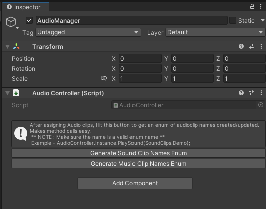

# com.homemade.modules.audio

:::info
Version: **1.1.0** <br/>
Github: **_[Link](https://github.com/hungpt17102k/com.homemade.modules.audio)_** <br/>
Dependencies: 
- **[com.homemade.pattern.singleton](../Unity%20Packages/com.homemade.pattern.singleton.md)**
:::

<!-- Introduction -->
This is simple package for audio manager, can use in any project.

## 1. Import

### Download from my registries
- Open Package Manager in Unity.
- Select Packages tab: My Registries.
- Download package: **com.homemade.modules.audio**
> **Follow the setup: [Click here](../Introduction.md#1-add-scope).**

### Import from github
- Link github: **[Link package](https://github.com/hungpt17102k/com.homemade.modules.audio)**
- Open Package Manager in Unity 
> **Follow this guide: [Click here](../Introduction.md#import-from-github).**

## 2. How to use

### AudioController
After you install the package, create an empty object name `AudioManager` add the script `AudioController`.



There are 2 buttons for generate clip name:
- `SoundClips.cs`

```cs
namespace com.homemade.modules.audio
{
    public class SoundClips
    {
        public const string SoundFx = "SoundFx";
    }
}
```

- `MusicClips.cs`

```cs
namespace com.homemade.modules.audio
{
    public class MusicClips
    {
        public const string BG_Music = "BG_Music";
    }
}
```

:::note
This is follow by the name of the audio file.
:::

### AudioCase
This `AudioController` will create `AudioCase` to controll the audio.

```cs
public enum AudioType
{
    Music = 0,
    Sound = 1
}

[Serializable]
public class AudioCase
{
    public AudioSource source;
    public AudioType type;

    public event Action OnAudioEnded;

    public AudioCase(AudioClip clip, AudioSource source, AudioType type)
    {
        this.source = source;
        this.type = type;
        this.source.clip = clip;
    }

    public void Complete()
    {
        OnAudioEnded?.Invoke();
    }

    public void Play()
    {
        source.Play();
    }

    public void Stop()
    {
        source.Stop();
    }
}
```

### API

#### Play
```cs
using com.homemade.modules.audio;

public class Game : MonoBehaviour
{
    private void Start()
    {
        // Sound
        AudioController.Instance.PlaySound(SoundClips.SoundFx);

        // Music
        AudioController.Instance.PlayMusic(MusicClips.BG_Music);
    }
}
```


#### PlaySmart
```cs
using com.homemade.modules.audio;

public class Game : MonoBehaviour
{
    private void Start()
    {
        // Sound
        AudioCase sound = AudioController.Instance.PlaySmartSound(SoundClips.SoundFx);

        // Music
        AudioCase music = AudioController.Instance.PlaySmartMusic(MusicClips.BG_Music);
    }
}
```

:::tip
You can direct controll the audio base on the **[AudioCase](#audiocase)**.
:::


#### PlayRandomMusic
```cs
using com.homemade.modules.audio;

public class Game : MonoBehaviour
{
    private void Start()
    {
        AudioController.Instance.PlayRandomMusic();
    }
}
```

#### Release
```cs
using com.homemade.modules.audio;

public class Game : MonoBehaviour
{
    private void Start()
    {
        // Sound
        AudioController.Instance.ReleaseSounds();

        // Music
        AudioController.Instance.ReleaseMusic();
    }
}
```

#### StopStream
```cs
using com.homemade.modules.audio;

public class Game : MonoBehaviour
{
    private IEnumerator Start()
    {
        AudioCase sound = AudioController.Instance.PlaySmartSound(SoundClips.SoundFx);

        yield return new WaitForSeconds(2f);

        AudioController.Instance.StopStream(sound);
    }
}
```

#### TurnOnOff
```cs
using com.homemade.modules.audio;

public class Game : MonoBehaviour
{
    private void Start()
    {
        // Sound
        AudioController.Instance.TurnOnOffSound(true);

        // Music
        AudioController.Instance.TurnOnOffMusic(true);
    }
}
```

#### ChangeVolume
```cs
using com.homemade.modules.audio;

public class Game : MonoBehaviour
{
    private void Start()
    {
        // You should set volume from 0f to 1f

        // Sound
        AudioController.Instance.ChangeSoundVolume(1f);

        // Music
        AudioController.Instance.ChangeMusicVolume(1f);
    }
}
```

### AudioUtils

#### OnComplete
```cs
using com.homemade.modules.audio;

public class Game : MonoBehaviour
{
    private void Start()
    {
        AudioCase sound = AudioController.Instance.PlaySmartSound(SoundClips.SoundFx);

        IEnumerator action = sound.OnComplete(() =>
        {
            Debug.Log("Sound complete");
        });
        StartCoroutine(action);
    }
}
```

:::note
It's very simple and esay to use. Hope you guys like it.
:::
