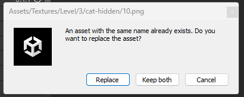

# com.homemade.utils.asset-overwriter

:::info
Version: **1.0.0**  
Github: **_[Link](https://github.com/hungpt17102k/com.homemade.utils.asset-overwriter)_**
:::

<!-- Introduction -->
This is simple package for overwrite asset, can use in any project.

## 1. Import

### Download from my registries
- Open Package Manager in Unity.
- Select Packages tab: My Registries.
- Download package: **com.homemade.utils.asset-overwriter**
> **Follow the setup: [Click here](../Introduction.md#1-add-scope).**

### Import from github
- Link github: **[Link package](https://github.com/hungpt17102k/com.homemade.utils.asset-overwriter)**
- Open Package Manager in Unity 
> **Follow this guide: [Click here](../Introduction.md#import-from-github).**

## 2. How to use
- You just need to drag the file into the project window of Unity with the same name file.
- It will popup this dialog

- **Replace**: will over write the asset in the project.
- **Keep both**: will keep the current asset and add the new asset then rename it by add '1'.

> _**Very easy and simple to use!**_

:::warning
You just replace files and assets, but not the folder.
:::
