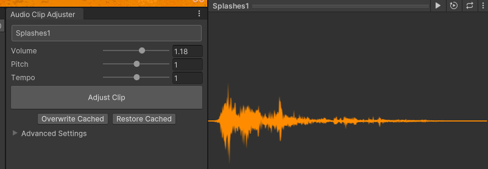

# com.homemade.utils.audio-clip-adjuster

:::info
Version: **1.0.0**  
Github: **_[Link](https://github.com/hungpt17102k/com.homemade.utils.audio-clip-adjuster)_**
:::

<!-- Introduction -->
This is simple package for adjust audio clip in Unity, can use in any project.
An extension for Unity that calls into FFmpeg to adjust audio clips quickly.

## 1. Import

### Download from my registries
- Open Package Manager in Unity.
- Select Packages tab: My Registries.
- Download package: **com.homemade.utils.audio-clip-adjuster**
> **Follow the setup: [Click here](../Introduction.md#1-add-scope).**

### Import from github
- Link github: **[Link package](https://github.com/hungpt17102k/com.homemade.utils.audio-clip-adjuster)**
- Open Package Manager in Unity 
> **Follow this guide: [Click here](../Introduction.md#import-from-github).**

## 2. Introduction

### Features
- Change the volume of an audio clip with the click of a button. No need to open Audacity!
- Change the pitch or tempo at the same time, if you'd like.
- Select multiple clips in Unity to edit them as a batch.
- Keeps the original clip in the Temp folder so it can be restored (as long as you don't close Unity).

### Requirements
You must have FFmpeg installed. It is a command line tool for converting and editing audio / video.

Link download **FFmpeg**: [Click here](https://www.ffmpeg.org/download.html)  
Link how to install **FFmpeg**: [Click here](https://phoenixnap.com/kb/ffmpeg-windows)

## 3. Installation
- Run ffmpeg in the command line to see if it's already installed.
- If not, download and unpack FFmpeg to your system.
- Ideally, add FFmpeg to your PATH. If you skip this step, you'll have to manually point to FFmpeg in the Audio Clip Adjuster settings.

:::note
Where to type in the **FFmpeg** path.

:::

## 4. How to use

- To open the Audio Clip Adjuster window, select an audio clip.
- In the inspector open the audio clip context menu (by clicking the three dots icon) and select "Edit Volume."
- Adjust the parameters and press "Adjust Clip" to modify the audio clip asset.
- Press "Restore Cached" to revert the clip to its original form. This option is only available until you close Unity.
- Press "Overwrite Cached" to destroy the original clip and apply these changes permanently. If you want to increase the volume above 200% you'll need to do this.
