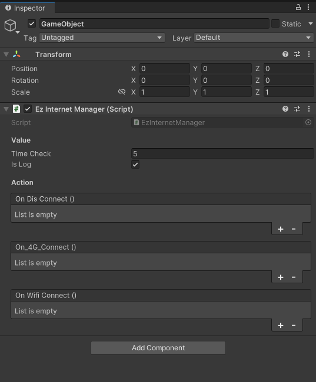

# com.homemade.utils.internet

:::info
Version: **1.0.0** <br/>
Github: **_[Link](https://github.com/hungpt17102k/com.homemade.utils.internet)_**
:::

<!-- Introduction -->
This is simple package for internet checking, can use in any project.

## 1. Import

### Download from my registries
- Open Package Manager in Unity.
- Select Packages tab: My Registries.
- Download package: **com.homemade.utils.internet**
> **Follow the setup: [Click here](../Introduction.md#1-add-scope).**

### Import from github
- Link github: **[Link package](https://github.com/hungpt17102k/com.homemade.utils.internet)**
- Open Package Manager in Unity 
> **Follow this guide: [Click here](../Introduction.md#import-from-github).**

## 2. How to use

### Code

```cs
using com.homemade.utils.internet;
using UnityEngine;

public class GameManager : MonoBehaviour
{
    public static GameManager Instance { get; private set; }

    private void Awake()
    {
        if(Instance != null && Instance != this)
        {
            Destroy(this);
        }
        else
        {
            Instance = this;
            DontDestroyOnLoad(this);
        }
    }

    private void Start()
    {
        // Create internet check
        EzInternet internet = new EzInternet();

        // Set properties
        internet.TimeCheck = 5f;
        internet.IsLog = false;
        internet.OnDisConnect += Disconect;
        internet.OnWifiConnect += ConnectWifi;
        internet.On_4G_Connect += Connect_4G;

        // Start checking
        internet.Start();
    }

    private void Disconect()
    {
        Debug.Log("Disconect");
    }

    private void ConnectWifi()
    {
        Debug.Log("Connect wifi");
    }

    private void Connect_4G()
    {
        Debug.Log("Connect 4G");
    }
}
```

### Component
Create an empty object and add component `EzInternetManager`



### EzInternetUtils
In this extension file has `OpenSetting` method.

```cs
// Android
EzInternetUtils.OpenAndroidSetting();

// IOS
EzInternetUtils.OpenIOS_Setting();

// IOS with native code
EzInternetUtils.OpenIOS_Setting_Native();
```
