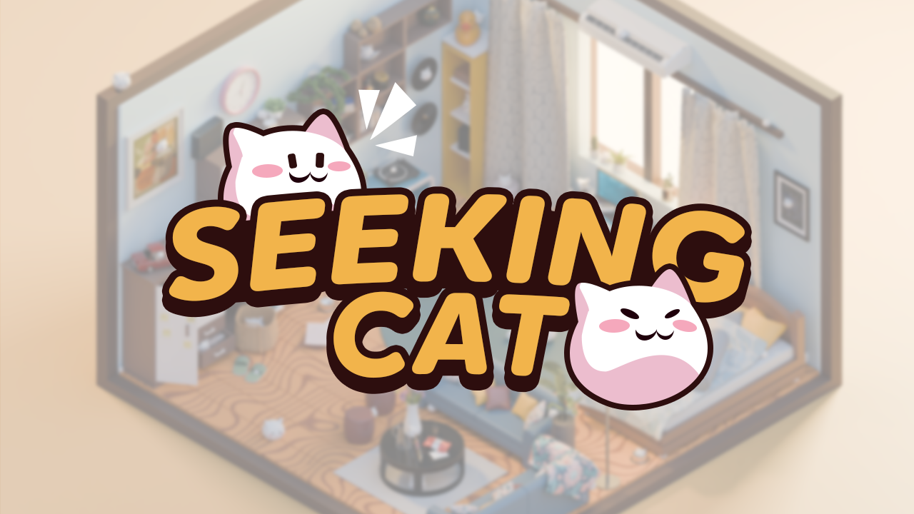

# Introduction

Welcome to **"Seeking Cat"**, a charming hidden object game where your mission is to find all the mischievous cats hiding in a cozy, cluttered room.

In this beautifully crafted, isometric environment, playful cats have tucked themselves away in the most unexpected places. With their tiny paws and curious eyes, these furry friends have found clever spots to hide among the room’s many items. Whether it’s a kitten peeking out from behind a stack of books, a cat curled up in a basket, or one perched high on a shelf, each feline is waiting to be found.

Can you find all the cats and prove yourself as the ultimate cat finder in **"Seeking Cat"**?

<!--  -->

# Published

This is our first game, and my first time published to Steam.  
Hope you guys will support us and play our games.

## Steam

<iframe src="https://store.steampowered.com/widget/3169040/" frameborder="0" width="646" height="190"></iframe>

## Itch.io

<iframe frameborder="0" src="https://itch.io/embed/2904839?linkback=true" width="552" height="167"><a href="https://homemadestudio.itch.io/seeking-cat">Seeking Cat by HomeMadeStudio</a></iframe>
